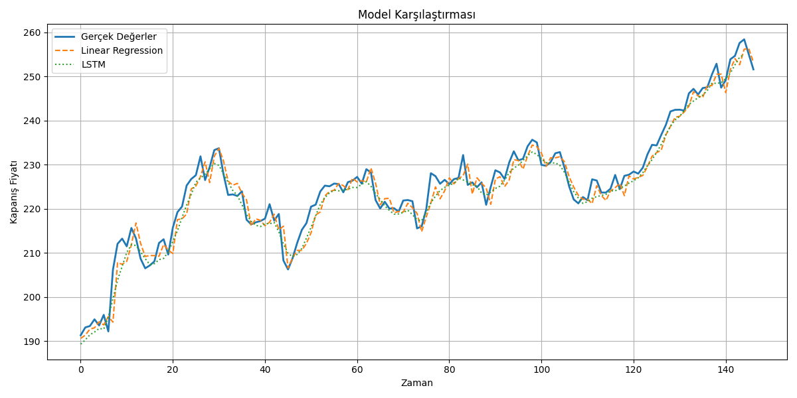

# 📈 Stock Price Predictor

This project demonstrates how to apply Linear Regression and LSTM models to predict Apple (AAPL) stock prices using historical data and engineered features.

## 📂 Project Structure

- `get_data.py` – Downloads or prepares the dataset (e.g., aapl.csv)
- `feature_engineering.py` – Adds lag features, moving averages, and volatility
- `model_linear.py` – Linear Regression model
- `model_lstm.py` – Basic LSTM model
- `model_lstm_advanced.py` – Improved LSTM model (with more tuning)
- `visualize_results.py` – Plots comparison between actual vs predicted prices

## 📊 Example Output

## 🚀 Tech Stack

- Python 3.12
- Pandas, NumPy, Scikit-learn
- TensorFlow / Keras
- Matplotlib

## 📌 Notes

> This project is educational and aims to explore stock price modeling, not to be used as a financial forecasting tool.

---

Feel free to fork, experiment, and improve!
